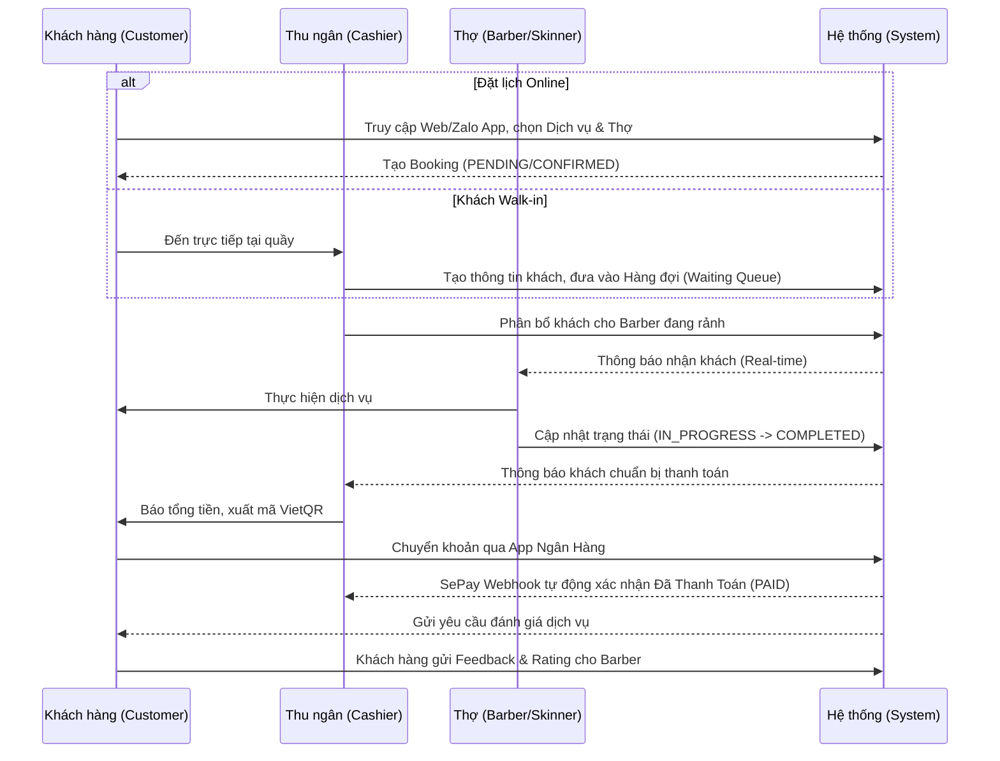

# REETRO BARBER SHOP — Hệ Thống Đặt Lịch & Quản Lý

> Nền tảng đặt lịch & quản lý hiện đại cho chuỗi barbershop, phân quyền chi tiết, tích hợp AI & Thanh toán tự động.

[](https://github.com/Pad2806/Barber_Booking/actions)

---

## Tài liệu chi tiết

| Tài liệu | Mô tả |
|----------|-------|
| [DEPLOYMENT.md](docs/DEPLOYMENT.md) | Hướng dẫn triển khai, CI/CD, Dokploy, cấu hình server |
| [USER_GUIDE.md](docs/USER_GUIDE.md) | Hướng dẫn sử dụng cho từng vai trò (Khách hàng, Thu ngân, Quản lý, Admin) |
| [PRICING.md](docs/PRICING.md) | Chi phí vận hành, bảng giá giải pháp, so sánh đối thủ |

---

## Tác nhân (Actors) & Tính năng hệ thống

Hệ thống được thiết kế với phân quyền chặt chẽ, tối ưu trải nghiệm cho từng bộ phận trong một hệ thống chuỗi Barbershop:

### 1. Khách hàng (CUSTOMER)
- Đặt lịch online qua **Website & Zalo Mini App**.
- Chọn chi nhánh (salon), dịch vụ, và thợ (stylist) yêu thích.
- Đặt cọc / Thanh toán bằng **VietQR + SePay** (webhook tự động xác nhận).
- Quản lý lịch sử dịch vụ, đánh giá & bình luận sau khi hoàn thành.
- **Tính năng (Đang phát triển):** Trợ lý AI Chatbot hỗ trợ tư vấn dịch vụ và giải đáp thắc mắc 24/7.

### 2. Thợ cắt tóc (BARBER / STYLIST)
- Nhận và xem danh sách các lịch hẹn được phân công cá nhân.
- Đăng ký lịch làm việc, quản lý ca trực.
- Gửi yêu cầu xin nghỉ phép và theo dõi trạng thái phê duyệt.
- Xem báo cáo hiệu suất, đánh giá trực tiếp từ khách hàng đối với cá nhân.

### 3. Nhân viên gội/massage (SKINNER)
- Chịu trách nhiệm thực hiện các dịch vụ chăm sóc da, gội đầu, massage trong các gói combo.
- Phối hợp nhịp nhàng với Barber để hoàn thiện dịch vụ cho khách.
- Quản lý ca làm việc và xin nghỉ phép tương tự Barber.

### 4. Thu ngân (CASHIER)
- Tiếp nhận khách vãng lai (walk-in) trực tiếp tại quầy, đưa khách vào hàng đợi.
- Quản lý hàng đợi (waiting queue) **real-time**, điều phối khách cho Barber/Skinner đang trống.
- Thực hiện thanh toán, checkout tại quầy (hỗ trợ tiền mặt, chuyển khoản tự động).
- Quản lý doanh thu ca trực của bản thân.

### 5. Quản lý chi nhánh (MANAGER)
- Lập lịch biểu (schedule) làm việc cho toàn bộ nhân sự tại chi nhánh.
- Phê duyệt / từ chối các yêu cầu xin nghỉ phép của nhân viên.
- Theo dõi trạng thái tất cả lịch hẹn, xử lý các vấn đề phát sinh tại salon.
- Xem báo cáo doanh thu chi tiết của chi nhánh, đánh giá hiệu suất nhân sự và phản hồi đánh giá khách hàng.

### 6. Chủ Salon (SALON_OWNER)
- Sở hữu và giám sát hoạt động của một hoặc nhiều chi nhánh salon.
- Theo dõi các báo cáo tổng quan, phân tích doanh thu hệ thống để đưa ra quyết định kinh doanh.

### 7. Quản trị viên hệ thống (SUPER_ADMIN)
- Quản trị toàn cục hệ thống chuỗi (tạo mới chi nhánh, dịch vụ, tài khoản).
- Phân quyền người dùng, quản lý Roles chuyên sâu.
- Cấu hình các tham số hệ thống, API Keys, cổng thanh toán và thiết lập White-label branding.

---

## Luồng nghiệp vụ cốt lõi (Core Flow)



---

## Kiến trúc hệ thống & Tech Stack

Dự án được xây dựng trên kiến trúc **Monorepo** quản lý bởi **Turborepo** và **pnpm**, giúp tối ưu hóa việc tái sử dụng code (types, UI components, utilities) giữa các nền tảng Frontend và Backend.

### Frontend (User Interfaces)
- **Framework:** Next.js 14 (App Router) — Sử dụng Server Components cho tốc độ tải trang nhanh và chuẩn SEO, kết hợp Client Components cho các tương tác mượt mà.
- **Styling & UI:** Tailwind CSS, Ant Design, shadcn/ui.
- **Mobile Ecosystem:** Zalo Mini App (xây dựng bằng ZMP v4), đồng bộ dữ liệu trực tiếp với Backend giúp khách hàng dễ dàng tiếp cận không cần cài ứng dụng ngoài.

### Backend (Core API)
- **Framework:** NestJS 10 — Cấu trúc hệ thống mở rộng, áp dụng nguyên lý Domain-Driven Design (DDD) giúp module hóa logic kinh doanh một cách sạch sẽ.
- **Cơ sở dữ liệu:** 
  - **PostgreSQL 16**: Lưu trữ cấu trúc dữ liệu bền vững, quản lý bằng **Prisma ORM**.
  - **Redis 7**: Xử lý Cache, hàng đợi hệ thống (Queues) và các tương tác thời gian thực.
- **Bảo mật & Authentication:** Passport.js (Local, Google, Facebook, Zalo) kết hợp luồng cấp quyền JWT.
- **Lưu trữ tĩnh:** Cloudinary (Quản lý avatar người dùng, hình ảnh salon, thư viện đánh giá).

### Tích hợp bên thứ 3 (Integrations)
- **Payment Automation:** Hệ thống sử dụng **SePay** lắng nghe biến động số dư ngân hàng và xác thực thanh toán hoàn toàn tự động cho luồng tạo Booking/Thanh toán.
- **Trí tuệ nhân tạo (AI):** Tích hợp nền tảng LLM **Google Gemini** để cung cấp trợ lý ảo phân tích hội thoại tự nhiên (WIP).
- **Hệ thống Email:** **Resend** tích hợp gửi thông báo, lịch hẹn, khôi phục mật khẩu.

---

## Bắt đầu nhanh

### Yêu cầu môi trường
- **Node.js** 18+
- **pnpm** 8+
- **Docker** & **Docker Compose**
- **PostgreSQL** 16 (Hoặc sử dụng image đi kèm trong Docker Compose)

### Cài đặt & Khởi chạy

```bash
# 1. Clone repository
git clone <repo-url>
cd Booking_Barber

# 2. Cài đặt các gói phụ thuộc (Dependencies)
pnpm install

# 3. Khởi tạo cấu hình biến môi trường
cp .env.example .env
# (Lưu ý: Thiết lập các biến môi trường cấu hình DB, API, Payment theo file DEPLOYMENT.md)

# 4. Khởi động Infrastructure (Postgres, Redis)
docker-compose up -d

# 5. Khởi tạo Database (Migration) & Dữ liệu mẫu (Seed)
cd apps/api
pnpm db:generate
pnpm db:migrate
pnpm db:seed    # Sinh sẵn tài khoản Super Admin, Dịch vụ và Role cơ bản

# 6. Khởi động môi trường Development
cd ../..
pnpm dev
```

**Các kết nối sau khi chạy thành công:**
- Giao diện Web: **http://localhost:3000**
- API Server: **http://localhost:3001**
- Swagger Docs: **http://localhost:3001/docs**

---

## Lệnh điều khiển hệ thống (Scripts)

### Development
```bash
pnpm dev              # Khởi chạy đồng thời toàn bộ (API + Web + Zalo)
pnpm dev:api          # Chỉ khởi chạy Backend API (port 3001)
pnpm dev:web          # Chỉ khởi chạy Website Frontend (port 3000)
pnpm dev:zalo         # Chỉ khởi chạy Zalo Mini App
pnpm build            # Biên dịch dự án chuẩn bị cho production
pnpm lint             # Kiểm tra chất lượng code với ESLint
pnpm format           # Căn chỉnh code tự động theo Prettier
```

### Quản lý Database (Chạy trong thư mục `apps/api`)
```bash
pnpm db:generate      # Sinh mã Prisma Client để truy vấn type-safe
pnpm db:migrate       # Cập nhật thay đổi schema vào Database hiện tại
pnpm db:push          # Đẩy cưỡng bức schema đang có lên DB (Dùng khi dev)
pnpm prisma studio    # Bật giao diện trình duyệt để xem/sửa Data trực tiếp
```

---

## Quy trình thanh toán tự động (Payment Automation)

Hệ thống mang lại trải nghiệm không chạm 100% trong thanh toán với cấu trúc vận hành:
`Khách hàng quét mã QR ➔ App Ngân Hàng báo có ➔ Webhook nhận tín hiệu ➔ Server xác nhận`

- **Đầu mối Webhook**: `POST /api/v1/payments/webhook/sepay`
- **Xử lý mã QR**: Hệ thống tự động thiết kế mã VietQR động bao gồm giá trị hóa đơn và nội dung chuyển khoản mã hóa riêng biệt cho từng mã hóa đơn `Booking`.

> Đọc thêm chi tiết kỹ thuật: [DEPLOYMENT.md](docs/DEPLOYMENT.md)

---

## Triển khai lên Production (CI/CD)

Hệ thống được thiết kế chuỗi luồng CI/CD (Continuous Integration & Delivery) hoàn toàn tự động qua GitHub Actions và giao tiếp trực tiếp tới server Dokploy:

```
Nhà phát triển Push code lên nhánh 'main'
       ↓
GitHub Actions (Lint → Build → Test)
       ↓
Build & Đẩy Docker Image lên GHCR (GitHub Container Registry)
       ↓
Dokploy Webhook kích hoạt báo hiệu server Pull image mới nhất
       ↓
Deploy hoàn tất (~3-5 phút không gây gián đoạn lớn)
```

---

## Kiến trúc White-Label cho Nhượng quyền

Toàn bộ hệ thống hỗ trợ cơ chế tùy chỉnh thương hiệu động (White-label), thuận tiện để triển khai hoặc nhượng quyền công nghệ cho đa đối tác:
1. **Thay đổi trung tâm**: Các cấu hình Tên thương hiệu, Logo, Bảng màu chính được định nghĩa tách biệt tại `packages/brand/src/config.ts`.
2. **Quản lý Domain**: Hỗ trợ nhanh chóng gắn domain riêng tư của doanh nghiệp.

> Tham khảo chi phí và cấu hình: [PRICING.md](docs/PRICING.md)

---

## Cấu trúc dự án Monorepo

```
Booking_Barber/
├── apps/
│   ├── api/              # Backend (NestJS, Prisma, API Services, Thống kê, Payment)
│   ├── web/              # Frontend (Next.js - Hệ thống đa Dashboards: Admin, Manager, Cashier, Barber, Customer)
│   └── zalo/             # Zalo Mini App dành cho trải nghiệm Khách hàng trên điện thoại
├── packages/
│   ├── shared/           # Chia sẻ Utils, Types, Validation Schemas (Zod/Class-validator)
│   └── brand/            # Lưu trữ toàn bộ Theme & Config cho việc white-label
├── docs/                 # Nơi chứa các tài liệu quy trình (Deployment, User Guide)
└── docker-compose.yml    # File định nghĩa cơ sở hạ tầng (Postgres, Redis)
```

---

## Hỗ trợ & Liên hệ

| Kênh | Thông tin liên hệ |
|------|---------|
| Email | support@reetro.vn |
| Hotline | 1900-xxxx |
| Tương tác | Thông qua tính năng AI Chatbot trên trang chủ |
| Tài liệu HDSD | [USER_GUIDE.md](docs/USER_GUIDE.md) |

---

## License

**Private** — All rights reserved

---

**Built by ReetroBarberShop Team** | [Pad2806](https://github.com/Pad2806)  
**Status**: Production Ready | **Version**: 1.0.0
